# Agent Sprite Forge

언어: [English](./README.md) | [繁體中文](./README.zh-TW.md) | [简体中文](./README.zh-CN.md) | [日本語](./README.ja.md) | [한국어](./README.ko.md)

<p align="center">
  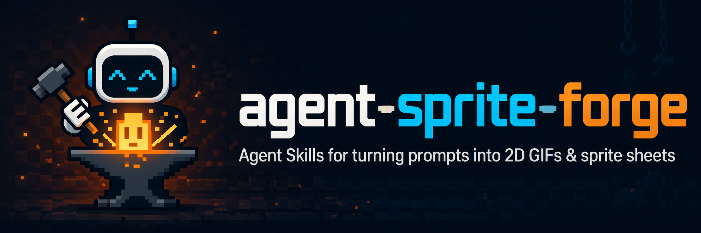
</p>

<p align="center">
  <strong>Codex용 2D 게임 에셋 Skill입니다. 게임에서 바로 다룰 수 있는 스프라이트, 레이어드 맵, 엔진 연동형 프로토타입 에셋을 생성합니다.</strong>
</p>

<p align="center">
  자연어로 요청하면 Codex가 에셋 파이프라인을 계획하고, 내장 이미지 생성으로 원본 비주얼을 만든 뒤, 로컬 프로세서가 배경 제거, 프레임 분할, 정렬, 검증, Godot / Unity / 일반 2D 게임 워크플로용 내보내기를 수행합니다.
</p>

<p align="center">
  <a href="#showcase">Showcase</a> |
  <a href="#included-skills">Skills</a> |
  <a href="#install">Install</a> |
  <a href="#suggested-prompts">Prompts</a> |
  <a href="#star-history">Star History</a>
</p>

## 무엇이 다른가

Agent Sprite Forge는 단순한 prompt 모음이 아닙니다. Codex-first 방식의 2D 게임 에셋 제작 워크플로입니다. Agent가 필요한 에셋과 제작 흐름을 판단하고, 이미지 생성이 원본 비주얼을 만들며, 결정론적 로컬 스크립트가 이를 재사용 가능한 게임 에셋으로 정리합니다.

<table>
  <tr>
    <td width="25%"><strong>스프라이트 시트</strong><br />캐릭터, 몬스터, NPC, props, 공격, 마법, projectile, impact, idle, walk, reference-guided variants.</td>
    <td width="25%"><strong>레이어드 맵</strong><br />ground-only base, dressed reference, prop pack, 투명 props, y-sort placement, collision, zones, previews.</td>
    <td width="25%"><strong>엔진 핸드오프</strong><br />Godot scenes, 편집 가능한 TileMapLayer, 분리 props, encounter grass, collision bodies, exits, debug player.</td>
    <td width="25%"><strong>로컬 정리</strong><br />마젠타 배경 제거, frame extraction, alignment, 투명 PNG/GIF export, prop-pack slicing, QA metadata.</td>
  </tr>
</table>

## Showcase

### Engine-Ready Prototypes

아래 예시는 Codex와 `agent-sprite-forge` workflow로 조립되었습니다. 생성된 에셋, 구조화된 scene data, 실제 플레이 가능한 prototype wiring까지 보여줍니다.

<table>
  <tr>
    <td align="center" width="50%">
      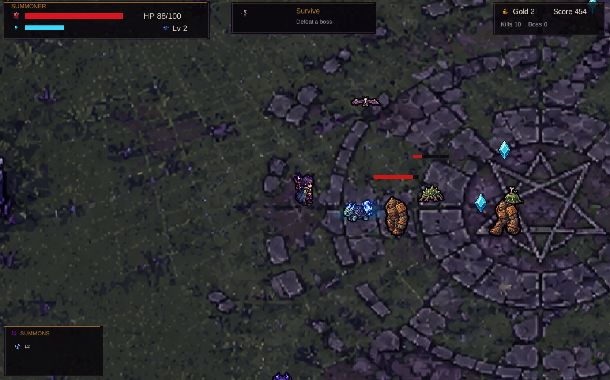
      <br />
      <strong>Summon Survivors - Unity WebGL</strong>
      <br />
      map art, hero sheets, summons, evolutions, enemies, bosses, pickups, HUD, FX, level-up choices, WebGL deployment까지 생성했습니다.
      <br />
      <a href="https://summon-survivors.vercel.app/">Play build</a> | <a href="https://drive.google.com/file/d/1TL7qRX95przTToZILVQ1EFwEXm3flB6t/view?usp=sharing">Build conversation</a>
    </td>
    <td align="center" width="50%">
      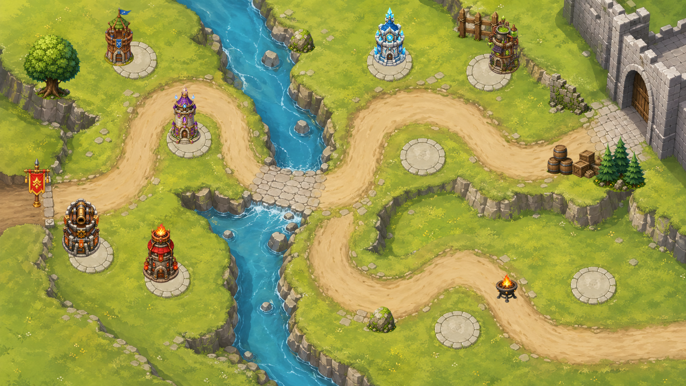
      <br />
      <strong>Forest Pass Defense - Godot Tower Defense</strong>
      <br />
      Godot 4 tower-defense prototype입니다. map, separated props, tower slots, towers, enemy sheets, boss/flying enemies, waves, HUD, build/upgrade/sell flow, projectiles를 포함합니다.
    </td>
  </tr>
  <tr>
    <td align="center" width="50%">
      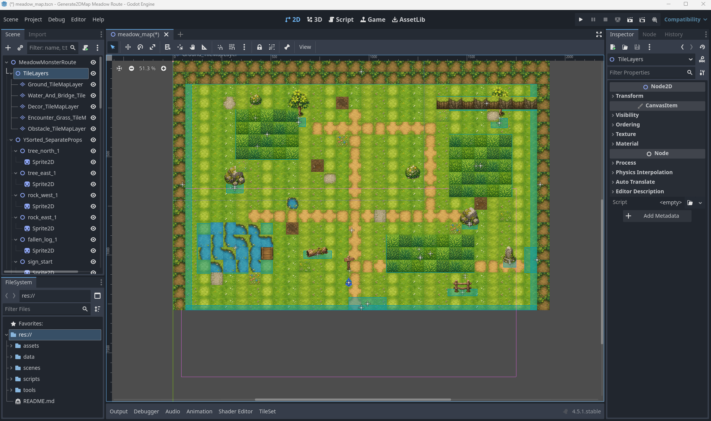
      <br />
      <strong>Editable RPG Map - Godot TileMap</strong>
      <br />
      이미지 생성 tileset과 prop sheet를 편집 가능한 <code>TileMapLayer</code>, <code>Sprite2D</code> props, encounter grass <code>Area2D</code>, <code>StaticBody2D</code> collision, exits, metadata, debug player/camera에 연결합니다.
    </td>
    <td align="center" width="50%">
      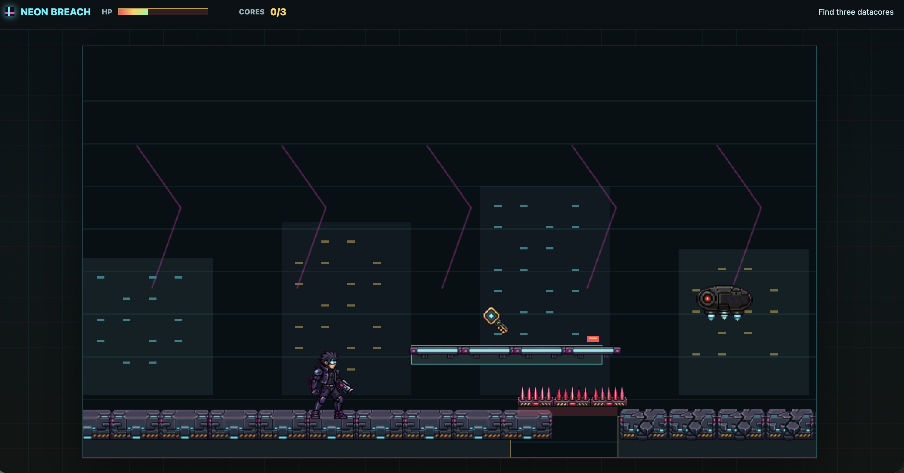
      <br />
      <strong>Neon Breach - Cyberpunk Side-Scroller</strong>
      <br />
      생성된 character, attack, map, gameplay assets를 기반으로 만든 플레이 가능한 횡스크롤 prototype입니다.
    </td>
  </tr>
  <tr>
    <td align="center" width="50%">
      
      <br />
      <strong>Sengoku Era - JavaScript monster-taming RPG</strong>
      <br />
      생성 캐릭터, starter selection, map flow, battle UI가 포함된 browser RPG prototype입니다.
      <br />
      <a href="https://sengoku-era.vercel.app/">Play build</a>
    </td>
    <td align="center" width="50%">
      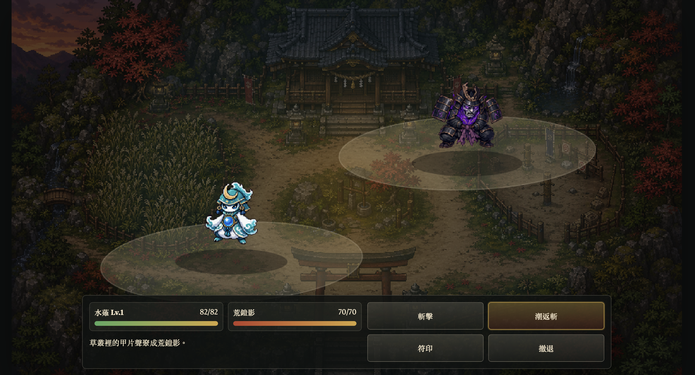
      <br />
      <strong>Starter selection and battle loop</strong>
      <br />
      sprite, monster, battle, map assets를 skill workflow로 생성해 조립한 compact JavaScript game showcase입니다.
    </td>
  </tr>
</table>

### Sprite Sheets And FX

애니메이션 유닛, 플레이어 캐릭터, 몬스터, props, spell bundles, projectile/impact FX, reference-guided variants가 필요할 때 `$generate2dsprite`를 사용합니다.

<table>
  <tr>
    <td align="center" width="25%"><br /><strong>Text to sprite</strong><br />자연어 요청에서 공격 애니메이션 생성.</td>
    <td align="center" width="25%">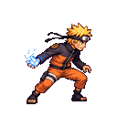<br /><strong>Character action</strong><br />투명 export가 포함된 compact 2D action sheet.</td>
    <td align="center" width="25%">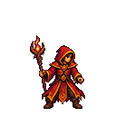<br /><strong>Spell cast</strong><br />bundle에 적합한 cast animation.</td>
    <td align="center" width="25%">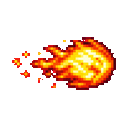<br /><strong>Projectile</strong><br />연결되는 projectile / impact workflow.</td>
  </tr>
</table>

### Layered RPG Map Pipeline

개별 sprite가 아니라 map이 필요하다면 `$generate2dmap`를 사용합니다. 읽기 쉬운 layered raster map에는 clean hand-painted HD game-map style을 권장합니다. ground-only base를 먼저 만들고, dressed reference, prop pack, transparent prop extraction, layered preview composition 순서로 진행합니다.

<table>
  <tr>
    <td align="center" width="33%">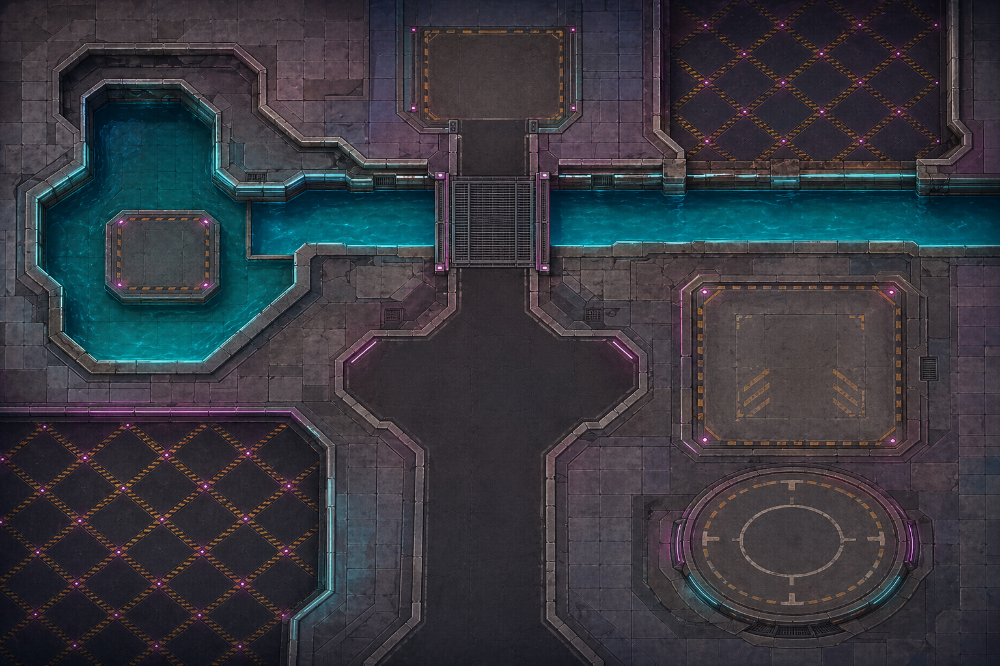<br /><strong>Ground-only base</strong></td>
    <td align="center" width="33%">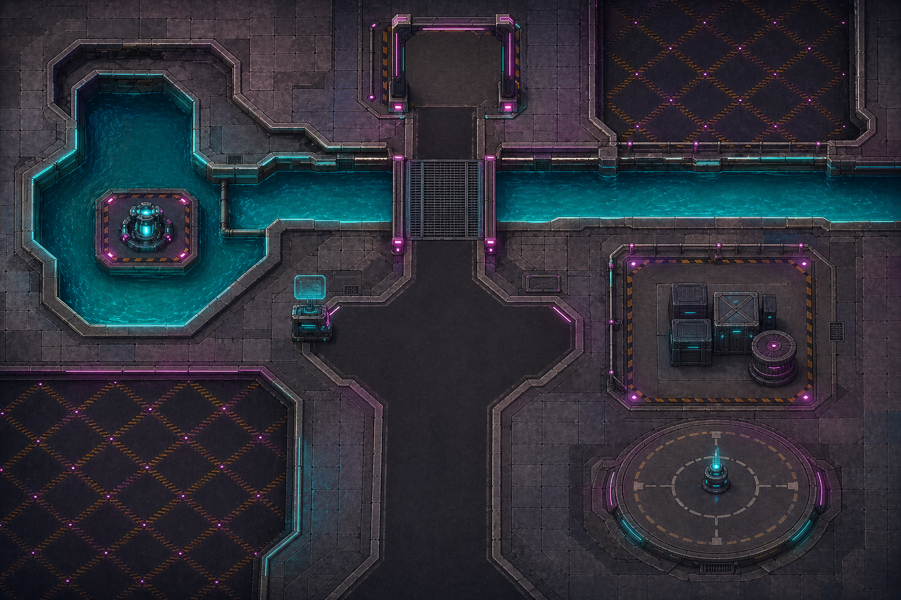<br /><strong>Dressed reference</strong></td>
    <td align="center" width="33%"><br /><strong>3x3 prop pack</strong></td>
  </tr>
</table>

<p align="center">
  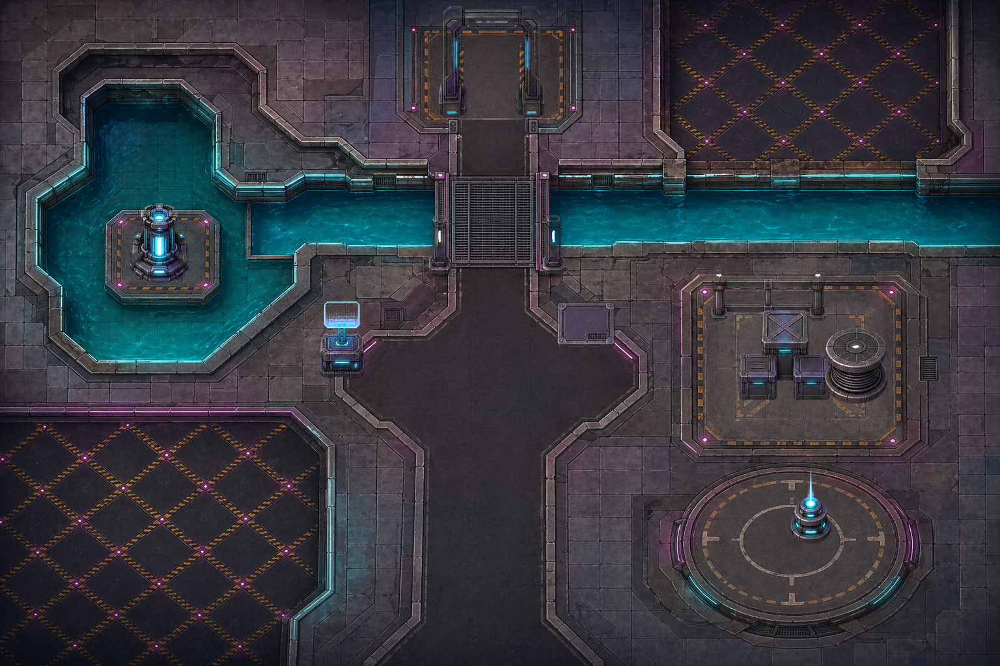
  <br />
  <strong>Flattened layered RPG map preview</strong>
</p>

```text
layered_raster + y_sorted_props + precise_shapes + trigger_zones + raw_canvas
```

### Godot Editable TileMap Export

`$generate2dmap`는 단일 flattened image가 아니라 편집 가능한 Godot map project도 만들 수 있습니다. 이 showcase는 이미지 생성 tileset과 3x3 prop sheet를 Godot 4.5 scene에 연결합니다.

<p align="center">
  
  <br />
  <strong>Godot editor scene: editable layers, props, zones, collision, exits, and debug player</strong>
</p>

Godot output에는 편집 가능한 `TileMapLayer` nodes, independent `Sprite2D` props, encounter grass `Area2D` zones, `StaticBody2D` collision blockers, exit `Area2D` zones, debug player/camera를 포함할 수 있습니다.

```text
image_gen tileset + prop_pack_3x3 + layered_tilemap + separate_props + trigger_zones + Godot_TileMap
```

## Included Skills

| Skill | 용도 | 출력 |
| --- | --- | --- |
| [`generate2dsprite`](./skills/generate2dsprite) | sprites, animation sheets, props, spell bundles, FX, reference variants, fixed-frame sheets용 layout guides | raw sheet, cleaned transparent sheet, frames, GIFs, metadata |
| [`generate2dmap`](./skills/generate2dmap) | baked maps, layered raster maps, clean HD RPG maps, prop packs, collision/zones, Godot-editable scenes, side-scroll/parallax scenes | base map, dressed/stage reference, prop pack, extracted props, preview, scene metadata |

`$generate2dmap`는 선택된 map pipeline이 재사용 가능한 투명 props를 필요로 할 때만 `$generate2dsprite`를 함께 사용합니다. 작은 환경 props는 `2x2`, `3x3`, `4x4` prop packs로 묶을 수 있습니다. platform, floor, bridge, wall, door, long hazard처럼 collision이 중요한 오브젝트는 개별 생성하거나 tile/object layer로 표현하는 것이 안전합니다.

## How It Works

1. 사용자가 Codex에 sprite, prop pack, map, engine-ready prototype을 요청합니다.
2. Agent가 asset type, action, bundle shape, sheet layout, frame count, style, alignment strategy를 결정합니다.
3. 내장 이미지 생성이 raw visual asset을 만듭니다.
4. 로컬 스크립트가 deterministic post-processing을 수행합니다: chroma-key cleanup, despill, frame extraction, alignment, prop-pack slicing, GIF/PNG export, validation metadata.
5. map과 prototype의 경우 Codex가 placement metadata, collision, trigger zones, Godot scenes, Unity project wiring도 조립할 수 있습니다.

스크립트는 창작의 중심이 아닙니다. 시각적 판단과 pipeline 결정은 Agent가 하고, Python tools는 반복 가능한 pixel/export 처리만 담당합니다.

## Install

### Windows PowerShell

```powershell
git clone https://github.com/0x0funky/agent-sprite-forge.git
cd .\agent-sprite-forge
python -m pip install -r .\requirements.txt
New-Item -ItemType Directory -Force -Path "$env:USERPROFILE\.codex\skills" | Out-Null
Copy-Item -Recurse -Force `
  ".\skills\*" `
  "$env:USERPROFILE\.codex\skills\"
```

### macOS / Linux

```bash
git clone https://github.com/0x0funky/agent-sprite-forge.git
cd ./agent-sprite-forge
python3 -m pip install -r ./requirements.txt
mkdir -p ~/.codex/skills
cp -R ./skills/* ~/.codex/skills/
```

설치 후 새 Codex session을 시작해 skills를 다시 로드하세요.

## Suggested Prompts

### Sprite

```text
Use $generate2dsprite to create a 3x3 idle for an ultimate earth titan.
```

```text
Use $generate2dsprite to create a side-view lightning knight attack animation.
```

```text
Use $generate2dsprite to create a wizard spell bundle with cast, projectile, and impact sprites.
```

### Map

```text
Use $generate2dmap to create a Godot-editable RPG map with separated props, encounter grass Area2D zones, collision StaticBody2D blockers, exit zones, and a debug player scene.
```

```text
Use $generate2dmap to create a playable side_scroll_mode platformer stage with parallax layers, stage-reference, separate platform_objects, collision metadata, camera bounds, and a stage-preview.
```

## What You Get

일반적인 sprite sheet output:

- `raw-sheet.png`
- `raw-sheet-clean.png`
- `sheet-transparent.png`
- frame PNGs
- `animation.gif`
- `prompt-used.txt`
- `pipeline-meta.json`

map output은 선택한 pipeline에 따라 달라집니다:

- Single baked map: 완성된 map image, 선택적 prompt file, 선택적 collision metadata.
- Layered raster map: base map, dressed reference, prop folders 또는 prop-pack extraction manifest, prop placement metadata, collision/zones metadata, flattened layered preview.
- Side-scroll map: parallax layers, stage reference, separate platform/object assets, objects/collision metadata, camera bounds, stage preview.
- Godot editable map: tileset/prop assets, scene files, layer metadata, collision/zones, exits, debug player setup.

## Notes

- 시점, 액션, 원하는 모션 스타일을 명확히 적을수록 결과가 안정적입니다.
- 큰 creature에는 `3x3 idle`이 잘 맞습니다.
- 작은 spell, projectile, impact는 `2x2` 또는 `2x3`가 잘 맞습니다.
- hero attack/shoot/cast는 body-only를 기본으로 권장합니다. 큰 slash, muzzle flash, projectile, impact는 별도 FX로 생성하세요.
- 상업 프로젝트에서는 오리지널 캐릭터나 권리를 보유한 IP를 우선 사용하세요.

## Star History

<a href="https://www.star-history.com/?repos=0x0funky%2Fagent-sprite-forge&type=date&legend=top-left">
 <picture>
   <source media="(prefers-color-scheme: dark)" srcset="https://api.star-history.com/chart?repos=0x0funky/agent-sprite-forge&type=date&theme=dark&legend=top-left" />
   <source media="(prefers-color-scheme: light)" srcset="https://api.star-history.com/chart?repos=0x0funky/agent-sprite-forge&type=date&legend=top-left" />
   
 </picture>
</a>

## License

MIT. See [LICENSE](./LICENSE).
