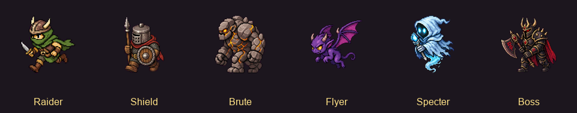
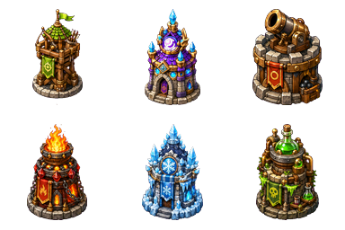
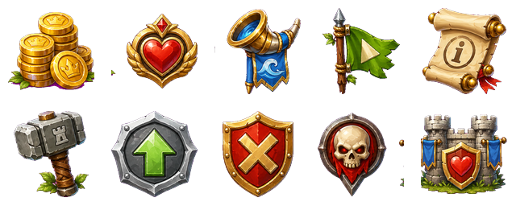
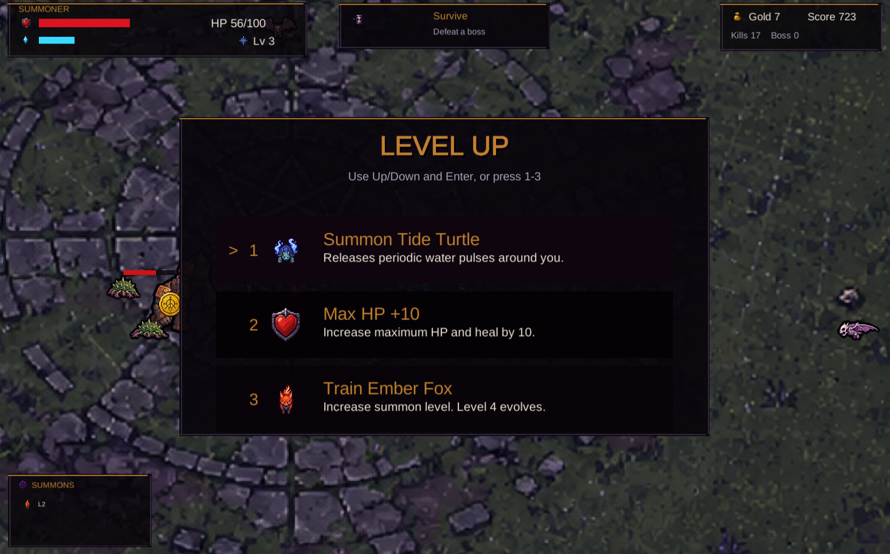
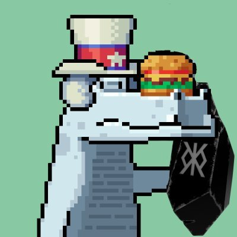
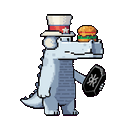
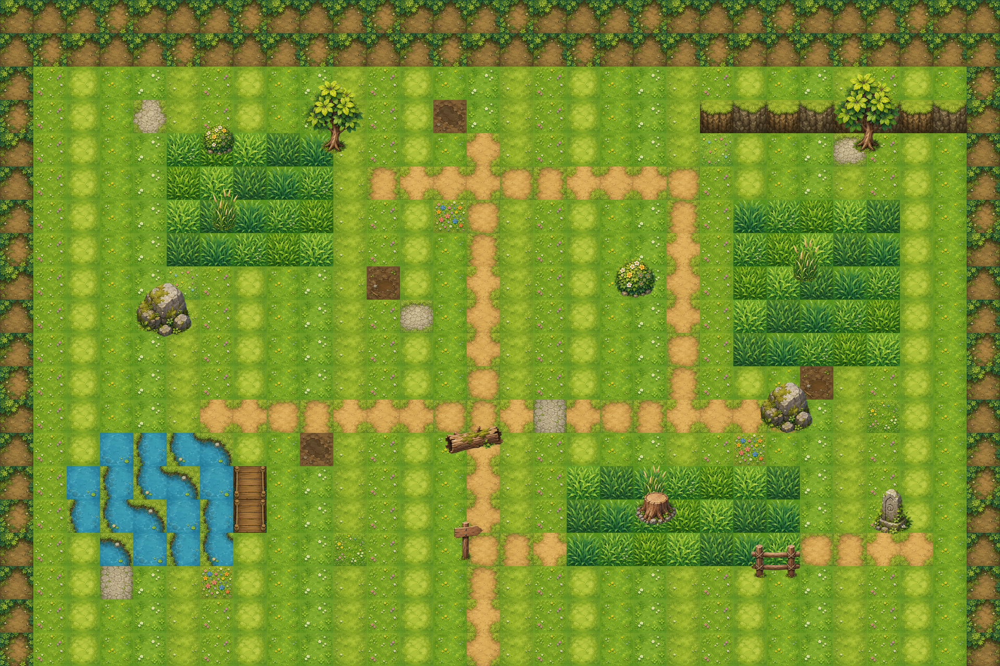
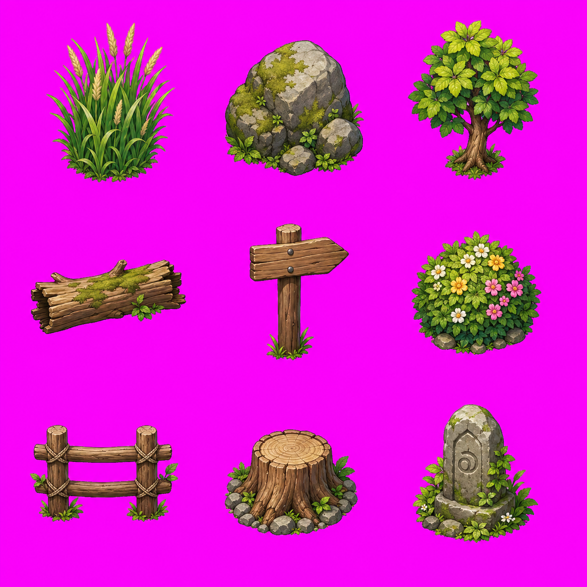

# Agent Sprite Forge

語言：[English](./README.md) | [繁體中文](./README.zh-TW.md) | [简体中文](./README.zh-CN.md) | [日本語](./README.ja.md) | [한국어](./README.ko.md)

<p align="center">
  
</p>

<p align="center">
  <strong>給 Codex 使用的 2D 遊戲資產 skills：生成可用於遊戲的 sprite、分層地圖與 engine-ready prototype。</strong>
</p>

<p align="center">
  用自然語言下需求。Codex 負責規劃資產 pipeline、使用內建 image generation 生圖，再由本地 processor 去背、切格、驗證與輸出，讓素材可以進 Godot、Unity 或一般 2D game workflow。
</p>

<p align="center">
  <a href="#showcase">Showcase</a> ·
  <a href="#included-skills">Skills</a> ·
  <a href="#安裝方式">安裝</a> ·
  <a href="#建議-prompt">Prompt</a> ·
  <a href="#star-history">Star History</a>
</p>

## 這個 repo 解決什麼

Agent Sprite Forge 不是單純的 prompt 集合。它是一組以 Codex 為核心的 2D game asset workflow：agent 先決定資產規劃，image generation 產生 raw visual，最後用 deterministic scripts 轉成真正可重用的遊戲素材。

<table>
  <tr>
    <td width="25%">
      <strong>Sprite sheets</strong><br />
      角色、怪物、props、攻擊、法術、projectile、impact、idle、walk 與 reference-guided variants。
    </td>
    <td width="25%">
      <strong>Layered maps</strong><br />
      Ground-only base、dressed reference、prop pack、透明 props、y-sort placement、collision、zones 與 preview。
    </td>
    <td width="25%">
      <strong>Engine handoff</strong><br />
      Godot scenes、可調整 TileMap layers、分離式 props、遇怪草叢、碰撞、出口區與 debug player。
    </td>
    <td width="25%">
      <strong>Local cleanup</strong><br />
      洋紅去背、frame extraction、alignment、透明 PNG / GIF、prop-pack slicing 與 QA metadata。
    </td>
  </tr>
</table>

## Showcase

### Engine-Ready Prototypes

這些範例都是用 Codex 搭配 `agent-sprite-forge` workflow 做出的成果。重點不是單張圖，而是完整流程：生成素材、整理 scene data，並接到可玩的 prototype 或可編輯的 engine scene。

<table>
  <tr>
    <td align="center" width="50%">
      
      <br />
      <strong>Summon Survivors — Unity WebGL</strong>
      <br />
      生成地圖、四方向主角、召喚獸、進化型態、敵人、Boss、掉落物、HUD、FX、升級選項，並完成 WebGL 部署。
      <br />
      <a href="https://summon-survivors.vercel.app/">Play build</a> · <a href="https://drive.google.com/file/d/1TL7qRX95przTToZILVQ1EFwEXm3flB6t/view?usp=sharing">Build conversation</a>
    </td>
    <td align="center" width="50%">
      
      <br />
      <strong>Forest Pass Defense — Godot Tower Defense</strong>
      <br />
      Godot 4 塔防 prototype：地圖、分離式 props、塔位、塔、敵人動畫、Boss / 飛行怪、波次、HUD、建塔 / 升級 / 賣塔、投射物與目標判定。
    </td>
  </tr>
  <tr>
    <td align="center" width="50%">
      
      <br />
      <strong>Editable RPG Map — Godot TileMap</strong>
      <br />
      Image-generated tileset 與 prop sheet 接進可編輯的 <code>TileMapLayer</code>、<code>Sprite2D</code> props、遇怪草叢 <code>Area2D</code>、<code>StaticBody2D</code> collision、出口區、metadata 與 debug player/camera。
    </td>
    <td align="center" width="50%">
      
      <br />
      <strong>Neon Breach — Cyberpunk Side-Scroller</strong>
      <br />
      以生成出的角色、攻擊、地圖與 gameplay assets 組成的橫向捲軸 playable prototype。
    </td>
  </tr>
  <tr>
    <td align="center" width="50%">
      
      <br />
      <strong>Sengoku Era — JavaScript Pokémon-like</strong>
      <br />
      Browser-based RPG prototype，包含生成角色、御魂選擇、map flow 與 battle UI。
      <br />
      <a href="https://sengoku-era.vercel.app/">Play build</a>
    </td>
    <td align="center" width="50%">
      
      <br />
      <strong>Starter selection and battle loop</strong>
      <br />
      用 skill workflow 生成 sprite、monster、battle 與 map assets，再組成的 compact JavaScript game showcase。
    </td>
  </tr>
</table>

<details>
<summary>更多 Godot 塔防輸出</summary>

<table>
  <tr>
    <td align="center" width="40%">
      
      <br />
      <strong>敵人 roster，包含飛行怪與 Boss</strong>
    </td>
    <td align="center" width="30%">
      
      <br />
      <strong>塔的 lineup</strong>
    </td>
    <td align="center" width="30%">
      
      <br />
      <strong>HUD 與 gameplay icons</strong>
    </td>
  </tr>
</table>

Godot prototype 輸出包含：

- `scenes/ForestPass.tscn`：base map、分離式 props、enemy paths、tower slots 與 HUD nodes。
- 六種塔系，包含生成出的塔圖與升級階段。
- 地面敵人、飛行怪與 Boss encounter 的動畫 sheets。
- wave、difficulty、tower catalog、collision、route 與 tower-slot metadata。
- Godot 內已接好的建塔、升級、賣塔、投射物與目標判定邏輯。

```text
image_gen map + separated props + tower sheets + enemy animation sheets + HUD icons + Godot gameplay wiring
```

</details>

<details>
<summary>更多 Unity survivors-like 輸出</summary>

<table>
  <tr>
    <td align="center" width="50%">
      
      <br />
      <strong>Unity WebGL gameplay：召喚獸、敵人、掉落物、HUD 與 objective flow</strong>
    </td>
    <td align="center" width="50%">
      
      <br />
      <strong>Level-up choices：召喚、訓練、能力值與回復選項</strong>
    </td>
  </tr>
</table>

Unity prototype 輸出包含：

- `Assets/Survivors/Scenes/SummonSurvivors.unity` 可直接開啟遊玩的 scene。
- `SurvivorContentDatabase.asset` 串接 hero、summon、enemy、pickup、HUD 與 FX sprites。
- 初始召喚獸選擇、生存目標、XP / coin 掉落、level-up choices、召喚獸訓練與進化流程。
- 敵人生成壓力、Boss timing、投射物攻擊、範圍傷害、血條與分數統計。
- `Builds/WebGL` WebGL build output 與 Vercel deployment config。

```text
image_gen map + directional hero sheets + summon/evolution sheets + enemy sheets + FX/HUD icons + Unity runtime + WebGL deploy
```

</details>

### Sprite Sheets And FX

當你需要角色、怪物、props、spell bundle、projectile / impact FX，或是依 reference 延伸角色時，使用 `$generate2dsprite`。

<table>
  <tr>
    <td align="center" width="25%">
      
      <br />
      <strong>Text to sprite</strong>
      <br />
      從自然語言生成攻擊動畫。
    </td>
    <td align="center" width="25%">
      
      <br />
      <strong>Character action</strong>
      <br />
      產出可透明輸出的 2D action sheet。
    </td>
    <td align="center" width="25%">
      
      <br />
      <strong>Spell cast</strong>
      <br />
      可放進 bundle 的施法動畫。
    </td>
    <td align="center" width="25%">
      
      <br />
      <strong>Projectile</strong>
      <br />
      可搭配 projectile / impact 的 workflow。
    </td>
  </tr>
</table>

<table>
  <tr>
    <td align="center" width="25%">
      
      <br />
      <strong>下</strong>
    </td>
    <td align="center" width="25%">
      
      <br />
      <strong>左</strong>
    </td>
    <td align="center" width="25%">
      
      <br />
      <strong>右</strong>
    </td>
    <td align="center" width="25%">
      
      <br />
      <strong>上</strong>
    </td>
  </tr>
</table>

<table>
  <tr>
    <td align="center" width="35%">
      
      <br />
      <strong>參考圖</strong>
    </td>
    <td align="center" width="65%">
      
      <br />
      <strong>Reference-guided sprite animation</strong>
    </td>
  </tr>
  <tr>
    <td align="center" width="35%">
      
      <br />
      <strong>參考圖</strong>
    </td>
    <td align="center" width="65%">
      
      <br />
      <strong>Reference-guided character action</strong>
    </td>
  </tr>
</table>

### 分層 RPG 地圖 Pipeline

當你需要地圖而不是單獨 sprite 時，使用 `$generate2dmap`。對可讀性高的 layered raster map，現在流程會優先使用 clean hand-painted HD game-map style：先生成 ground-only base，再生成 dressed reference，接著生成 prop pack，最後切出透明 props 並合成 layered preview。

<table>
  <tr>
    <td align="center" width="33%">
      
      <br />
      <strong>Ground-only base</strong>
    </td>
    <td align="center" width="33%">
      
      <br />
      <strong>Dressed reference</strong>
    </td>
    <td align="center" width="33%">
      
      <br />
      <strong>3x3 prop pack</strong>
    </td>
  </tr>
</table>

<p align="center">
  
  <br />
  <strong>Flattened layered RPG map preview</strong>
</p>

```text
layered_raster + y_sorted_props + precise_shapes + trigger_zones + raw_canvas
```

### Godot 可調整 TileMap 匯出

`$generate2dmap` 也可以輸出可在 Godot 裡調整的地圖工程，而不是只給一張 flattened image。這個 showcase 使用 image-generated tileset 和 3x3 prop sheet，接到 Godot 4.5 scene。

<p align="center">
  
  <br />
  <strong>Godot editor scene：可調整 layers、props、zones、collision、exits 與 debug player</strong>
</p>

<table>
  <tr>
    <td align="center" width="50%">
      
      <br />
      <strong>Layered map preview</strong>
    </td>
    <td align="center" width="50%">
      
      <br />
      <strong>Collision and zone debug overlay</strong>
    </td>
  </tr>
  <tr>
    <td align="center" width="50%">
      
      <br />
      <strong>Image-generated tileset atlas</strong>
    </td>
    <td align="center" width="50%">
      
      <br />
      <strong>3x3 generated prop pack</strong>
    </td>
  </tr>
</table>

Godot 輸出包含可調整的 `TileMapLayer`、獨立 `Sprite2D` props、遇怪草叢 `Area2D` zones、`StaticBody2D` collision blockers、出口 `Area2D` zones，以及 debug player/camera。

```text
image_gen tileset + prop_pack_3x3 + layered_tilemap + separate_props + trigger_zones + Godot_TileMap
```

### 可玩遊戲 Prompt 範例

<details>
<summary>Cyberpunk side-scroller prompt</summary>

```text
use $generate2dsprite to create a 2D side-scrolling game similar to Mega Man. It should include attack mechanics, map elements, and all the essential features. I would like you to design it, and all the necessary assets should be created using this skill. It needs to be an actually playable game, with a cyberpunk story setting.
```

</details>

<details>
<summary>戰國 Pokémon-like prototype</summary>

連結：<a href="https://sengoku-era.vercel.app/">Play the JavaScript browser build</a>

<table>
  <tr>
    <td align="center" width="50%">
      
      <br />
      <strong>初始御魂選擇</strong>
    </td>
    <td align="center" width="50%">
      
      <br />
      <strong>戰鬥場景</strong>
    </td>
  </tr>
</table>

```text
Use $generate2dsprite to create a 2D game similar to Pokemon. You only need to build one scene for now. It must include a starter monster selection mechanic, a battle screen, and all basic gameplay functions. I would like you to design all the elements and the story, and you can also decide which game engine to use. Use this skill to create any assets you need. The story should be set in the Sengoku period.
```

</details>

## Included Skills

| Skill | 適合用途 | 輸出 |
| --- | --- | --- |
| [`generate2dsprite`](./skills/generate2dsprite) | Sprites、animation sheets、props、spell bundles、FX、reference variants、固定 frame sheet 可選 layout guides | Raw sheet、cleaned transparent sheet、frames、GIFs、metadata |
| [`generate2dmap`](./skills/generate2dmap) | Baked maps、layered raster maps、clean HD RPG maps、prop packs、collision / zones、Godot-editable scenes | Base map、dressed reference、prop pack、extracted props、preview、scene metadata |

`$generate2dmap` 只有在選定的地圖 pipeline 需要可重用透明 props 時，才會使用 `$generate2dsprite`。小型環境物件可以批次生成為 `2x2`、`3x3` 或 `4x4` prop pack，再切成個別透明 props。簡單地圖可以維持單張 baked image。

當流程需要視覺 reference 時，兩個 skills 都遵守同一個 wrapper 規則：先讓圖片出現在對話上下文。使用者上傳的圖片與剛生成的圖片已經在上下文中；local file 則先用 `view_image` 打開，再要求內建 image generation 保留角色 identity、風格、地圖 layout 或 sprite 進化脈絡。

## 運作方式

1. 使用者請 Codex 生成 sprite、prop pack、地圖或 engine-ready prototype。
2. Agent 決定 asset type、action、bundle shape、sheet layout、frame count、style 與 alignment strategy。
3. Codex 內建 image generation 產生 raw visual asset。
4. 本地 scripts 做 deterministic post-processing：洋紅去背、despill、切格、對齊、prop-pack slicing、GIF / PNG export 與 validation metadata。
5. 對地圖或 prototype，Codex 也可以組裝 placement metadata、collision、trigger zones、Godot scenes 或 Unity project wiring。

Script 不是創意大腦。Agent 負責美術與 pipeline 決策，Python tools 只負責可重現的像素處理與輸出。

## 可以生成什麼

- Creature、character、player、NPC、props、monster
- Spell cast、projectile、impact、explosion、FX sheet
- 小型 bundle，例如 `unit_bundle`、`spell_bundle`、`combat_bundle`
- 依 reference 生成的 sprite 變體、動畫 sheet 與進化線
- Single baked map、clean HD layered map、prop-pack map 與 flattened preview
- 可玩地圖用的 collision / zone metadata
- Godot 可開啟調整的地圖工程，包含 `TileMapLayer`、分離式 props、遇怪草叢、collision、出口區與 debug player scene
- 當使用者要求接 engine 時，也可以協助組出 prototype-scale Godot / Unity scene

## 安裝方式

### Option 1: Windows PowerShell

先 clone repo，安裝本地 processor 依賴，再把兩個 skills 複製到 Codex skills 目錄：

```powershell
git clone https://github.com/0x0funky/agent-sprite-forge.git
cd .\agent-sprite-forge
python -m pip install -r .\requirements.txt
New-Item -ItemType Directory -Force -Path "$env:USERPROFILE\.codex\skills" | Out-Null
Copy-Item -Recurse -Force `
  ".\skills\*" `
  "$env:USERPROFILE\.codex\skills\"
```

### Option 2: macOS / Linux

```bash
git clone https://github.com/0x0funky/agent-sprite-forge.git
cd ./agent-sprite-forge
python3 -m pip install -r ./requirements.txt
mkdir -p ~/.codex/skills
cp -R ./skills/* ~/.codex/skills/
```

安裝完後建議重新開一個新的 Codex session，讓 skills 重新載入。

## Python 依賴

本地後處理目前依賴：

- `Pillow`
- `numpy`

這些都列在 [`requirements.txt`](./requirements.txt)。雖然 Codex 本身負責生圖，但你仍然需要這些 Python 套件完成洋紅去背、切格、主體 bbox 偵測、對齊 / 縮放、透明 PNG / GIF 輸出，以及 prop-pack slicing。

## Repo 結構

```text
agent-sprite-forge/
  README.md
  README.zh-TW.md
  requirements.txt
  src/
  skills/
    generate2dmap/
      SKILL.md
      agents/
        openai.yaml
      references/
        layered-map-contract.md
        map-strategies.md
        prop-pack-contract.md
      scripts/
        compose_layered_preview.py
        extract_prop_pack.py
    generate2dsprite/
      SKILL.md
      agents/
        openai.yaml
      references/
        modes.md
        prompt-rules.md
      scripts/
        generate2dsprite.py
        make_layout_guide.py
```

## 建議 Prompt

### Sprite

```text
Use $generate2dsprite to create a 3x3 idle for an ultimate earth titan.
```

```text
Use $generate2dsprite to create a side-view lightning knight attack animation.
```

```text
Use $generate2dsprite to create a late-Sengoku player_sheet for a wandering fire swordsman.
```

```text
Use $generate2dsprite to create a wizard spell bundle with cast, projectile, and impact sprites.
```

### Map

```text
Use $generate2dmap to create a small fixed-screen pixel-art battle arena with simple collision.
```

```text
Use $generate2dmap to create a top-down RPG forest shrine map. Use a layered raster pipeline, a 3x3 prop pack for small environmental props, precise collision, encounter grass zones, a rest point, and actors that can walk in front of and behind tall props.
```

```text
Use $generate2dmap to create a Godot-editable RPG map with separated props, encounter grass Area2D zones, collision StaticBody2D blockers, exit zones, and a debug player scene.
```

## 會輸出什麼

一般 sprite sheet 類型的輸出通常包含：

- `raw-sheet.png`
- `raw-sheet-clean.png`
- `sheet-transparent.png`
- frame PNGs
- `animation.gif`
- `prompt-used.txt`
- `pipeline-meta.json`

如果是 player walk sheet，通常還會額外輸出各方向 strip 與各方向 GIF。

如果是地圖輸出，結果會依選擇的 pipeline 而定：

- Single baked map：完整地圖圖檔、可選的 prompt file，以及可選的 collision metadata。
- Layered raster map：base map、dressed reference、生成出的 prop folders 或 prop-pack extraction manifest、prop 擺放資料、collision / zones metadata，以及 flattened layered preview。
- Godot editable map：tileset / prop assets、scene files、layer metadata、collision / zones、exits 與 debug player setup。

## 備註

- Prompt 越清楚，結果通常越穩。最好明確描述視角、動作與動畫型態。
- 大型 creature 通常比較適合 `3x3 idle`。
- 小型 spell / projectile 通常比較適合 `1x4`、`2x2` 或 `2x3`。
- Layout guide 適合固定 frame action sheet 與 prop pack，但不一定會讓緊湊攻擊 sheet 更好。
- 如果要商用，建議優先使用原創角色或你自己持有權利的 IP。

## Star History

<a href="https://www.star-history.com/?repos=0x0funky%2Fagent-sprite-forge&type=date&legend=top-left">
 <picture>
   <source media="(prefers-color-scheme: dark)" srcset="https://api.star-history.com/chart?repos=0x0funky/agent-sprite-forge&type=date&theme=dark&legend=top-left" />
   <source media="(prefers-color-scheme: light)" srcset="https://api.star-history.com/chart?repos=0x0funky/agent-sprite-forge&type=date&legend=top-left" />
   
 </picture>
</a>

## 授權

MIT。請見 [LICENSE](./LICENSE)。
